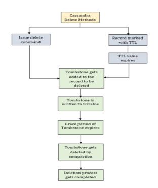
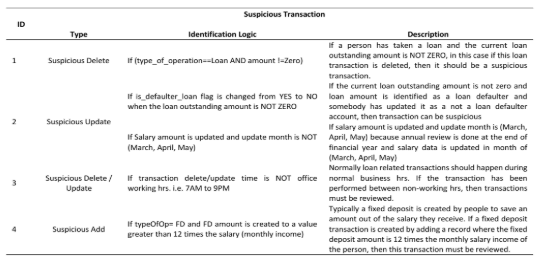
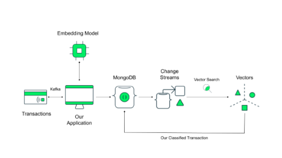
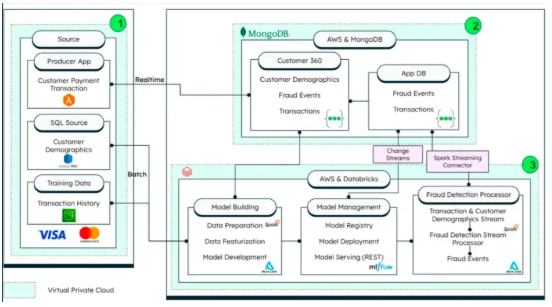
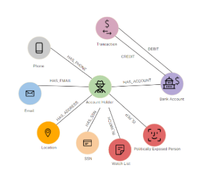
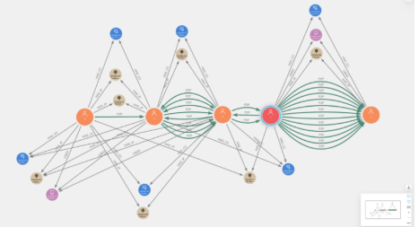

# Projeto de Disciplina – Estudo Teórico Sobre o Uso de Tecnologias NoSQL para Detecção de Fraudes em Sistemas Financeiros

---

**Universidade Federal de São Carlos**  
Curso: Bacharelado em Ciência da Computação – Campus Sorocaba  
Disciplina: Processamento Massivo de Dados  
Professora: Profa. Dra. Sahudy Montenegro González

---

## Grupo G1

**Integrantes:**

- Paulo César dos Anjos – 8001490
- Pedro Henrique Candido De Sousa – 8000863

---

## Resumo

Com o avanço digital, fraudes financeiras tornaram-se mais frequentes e complexas. Bancos NoSQL se destacam por lidar melhor com grandes volumes de dados e análises em tempo real. Este estudo avalia Cassandra, MongoDB, Neo4j e DynamoDB/DocumentDB na detecção dessas fraudes.

---

## Sumário

- [1. Introdução](#1-introdução)
  - [1.1 Contextualização das fraudes em sistemas financeiros](#11-contextualização-das-fraudes-em-sistemas-financeiros)
  - [1.2 Motivação para o uso de bancos NoSQL](#12-motivação-para-o-uso-de-bancos-nosql---12-motivação-para-o-uso-de-bancos-nosql)
  - [1.3 Objetivos do estudo e escopo](#13-objetivos-do-estudo-e-escopo---13-objetivos-do-estudo-e-escopo)
- [2. Metodologia](#2-metodologia)
- [3. Panorama das Tecnologias NoSQL em Análise de Fraudes](#3-panorama-das-tecnologias-nosql-em-análise-de-fraudes)
  - [3.1 Cassandra](#31-cassandra)
  - [3.2 MongoDB](#32-mongodb)
  - [3.3 Neo4j](#33-neo4j)
  - [3.4 DynamoDB / DocumentDB](#34-dynamodb--documentdb-34-dynamodb--documentdb)
- [4. Comparativo entre Tecnologias NoSQL na Detecção de Fraudes](#4-comparativo-entre-tecnologias-nosql-na-detecção-de-fraudes)
  - [4.1 Visão Geral e Paradigma de Dados](#41-visão-geral-e-paradigma-de-dados)
  - [4.2 Modelagem de Dados e Flexibilidade](#42-modelagem-de-dados-e-flexibilidade)
  - [4.3 Suporte a Algoritmos de Detecção de Fraudes](#43-suporte-a-algoritmos-de-detecção-de-fraudes)
  - [4.4 Performance, Escalabilidade e Latência](#44-performance-escalabilidade-e-latência)
  - [4.5 Custos e Complexidade Operacional](#45-custos-e-complexidade-operacional)
  - [4.6 Comparação Baseada no Tipo de Fraude Detectável](#46-comparação-baseada-no-tipo-de-fraude-detectável)
- [5. Síntese Crítica Comparativa de Modelos NoSQL](#5-síntese-crítica-comparativa-de-modelos-nosql)
- [6. Referências Bibliográficas](#6-referências-bibliográficas)

### 1\. Introdução

#### 1.1 Contextualização das fraudes em sistemas financeiros

A crescente digitalização dos serviços financeiros trouxe benefícios significativos para consumidores e instituições, como agilidade em operações, disponibilidade global e novos modelos de crédito e pagamento. No entanto, esse mesmo avanço tecnológico facilitou o surgimento e a sofisticação de fraudes financeiras, que vão desde transações não autorizadas e falsificação de identidade até esquemas mais complexos como lavagem de dinheiro e fraudes em rede. O volume massivo de dados transacionais, a alta frequência de operações e a necessidade de resposta em tempo real impõem desafios consideráveis à detecção eficiente dessas anomalias. Em cenários críticos, atrasos de segundos podem representar perdas financeiras significativas, além de impactos em reputação e conformidade regulatória.

#### 1.2 Motivação para o uso de bancos NoSQL {#1.2-motivação-para-o-uso-de-bancos-nosql}

Bancos de dados relacionais tradicionais, embora robustos, apresentam limitações quando aplicados a cenários de alta variabilidade e escala horizontal, como é o caso de sistemas antifraude. A rigidez do esquema, o custo de escalabilidade vertical e a latência em consultas complexas dificultam sua aplicação em arquiteturas modernas de detecção de fraude. Por outro lado, bancos de dados NoSQL surgem como alternativas mais adequadas por oferecerem:  
(i) **flexibilidade de esquema**, permitindo armazenar diferentes formatos e tipos de dados de forma ágil;  
(ii) **escalabilidade horizontal**, ideal para lidar com picos de carga e volumes crescentes de transações; e  
(iii) **desempenho otimizado**, por meio de estruturas de dados específicas, como grafos, documentos ou colunas, que se ajustam melhor aos padrões de acesso exigidos por soluções antifraude. Além disso, muitas tecnologias NoSQL integram recursos nativos de análise, como algoritmos de grafos ou integração com pipelines de machine learning, permitindo análises mais profundas e rápidas.

#### 1.3 Objetivos do estudo e escopo {#1.3-objetivos-do-estudo-e-escopo}

Este relatório tem como objetivo investigar e analisar criticamente o uso de bancos NoSQL em soluções de detecção de fraudes no setor financeiro. A partir de uma revisão de estudos acadêmicos e casos práticos da indústria, serão exploradas as tecnologias Apache Cassandra, MongoDB, Neo4j e Amazon DynamoDB/DocumentDB, cada uma representando diferentes paradigmas de armazenamento NoSQL: colunar, orientado a documentos, grafo e chave-valor/documento híbrido. O estudo buscará compreender como essas tecnologias são empregadas na prática para lidar com requisitos típicos da detecção de fraudes, como ingestão em larga escala, consultas de baixa latência, análise de redes de relacionamento, aprendizado de máquina e manutenção de consistência em ambientes distribuídos. Com base nas informações reunidas, será realizada uma comparação estruturada entre as abordagens, com destaque para seus pontos fortes, limitações e adequação a diferentes cenários. Ao final, pretende-se oferecer uma síntese crítica das vantagens e trade-offs que essas soluções proporcionam frente aos desafios específicos da detecção de fraudes financeiras.

### 2\. Metodologia

Este trabalho tem como objetivo analisar o uso de tecnologias NoSQL no combate a fraudes em sistemas financeiros. Para isso, adotamos uma abordagem qualitativa baseada em pesquisa bibliográfica. Inicialmente, realizamos uma busca por fontes confiáveis, atualizadas e com conteúdo aprofundado, que abordassem tanto o problema das fraudes financeiras quanto a aplicação de tecnologias de banco de dados NoSQL como parte da solução. A partir dessa busca, selecionamos quatro tecnologias representativas do ecossistema NoSQL: Cassandra, MongoDB, Neo4j e DynamoDB (da Amazon). Essas tecnologias foram escolhidas por sua relevância prática no tema abordado.

O trabalho foi estruturado em seções dedicadas a cada uma dessas tecnologias. Em cada seção, realizamos uma síntese das informações obtidas nas fontes consultadas; em seguida, desenvolvemos uma seção comparativa, onde analisamos semelhanças, diferenças, pontos fortes e limitações de cada tecnologia. Por fim, construímos uma análise crítica, na qual refletimos sobre os aprendizados obtidos ao longo do estudo e os desafios práticos envolvidos na aplicação dessas soluções no mercado financeiro.

### 3\. Panorama das Tecnologias NoSQL em Análise de Fraudes

#### 3.1 Cassandra

Apache Cassandra é um banco de dados NoSQL distribuído, orientado a colunas, projetado para suportar grandes volumes de dados com alta escalabilidade horizontal, tolerância a falhas e disponibilidade contínua. Seu modelo de dados se baseia em “column families”, onde os dados são agrupados em linhas identificadas por uma partition key e ordenadas por clustering key, permitindo acesso eficiente a registros temporais relacionados a uma entidade. No estudo de Chopade et al. (2025), Cassandra é utilizado como camada de persistência em um sistema antifraude que processa operações financeiras suspeitas. O foco está na detecção de transações deletadas ou alteradas de forma anômala, associando lógica de verificação a campos como operation_type, is_defaulter_loan e transaction_amount.

Do ponto de vista arquitetural, o sistema descrito integra Cassandra com ferramentas de análise forense que exploram os logs de transações (commitlog, system log, debug log) e os arquivos SSTable. Os eventos deletados são marcados com tombstones, que permanecem armazenados durante o gc_grace_seconds (padrão de 10 dias), conforme detalhado por Chopade et al. (2025).



_Figura 1 – Representação do processo de exclusão em Cassandra. A imagem demonstra como, ao deletar um registro, é gerado um tombstone que marca logicamente a remoção, permanecendo disponível durante o período de gc_grace_seconds. Adaptado de Chopade et al. (2025)._

O estudo de Chopade et al. (2025) exemplifica como essas funcionalidades do Cassandra são aplicadas na prática. Os autores desenvolvem uma ferramenta que identifica transações suspeitas baseadas em condições heurísticas, como exclusões de empréstimos não quitados (ver Figura 3\) ou atualizações de salário fora do período de revisão anual. A ferramenta analisa os tombstones e logs do Cassandra durante o período de gc_grace_seconds, permitindo não apenas a detecção em tempo real, mas também a recuperação forense de dados alterados ou excluídos indevidamente. A abordagem, porém, limita-se a fraudes baseadas em padrões temporais ou atributos isolados, sendo menos eficaz para fraudes em rede, cenário onde bancos de grafos seriam mais adequados.



_Figura 2: Condições heurísticas para identificação de transações suspeitas em sistemas financeiros (adaptado de Chopade et al., 2025)._

A tabela detalha quatro categorias de operações anômalas: (1) Exclusões de empréstitos não quitados, (2) Atualizações de salário fora do período de revisão anual, (3) Operações realizadas em horários não comerciais, e (4) Criação de depósitos fixos com valores discrepantes da renda mensal. Essas regras são aplicadas na análise forense de logs e tombstones do Cassandra durante o período de gc_grace_seconds.

As condições específicas para identificação de transações suspeitas são:

- "Suspicious Delete 1": Se type_of_operation for 'Loan' E amount for diferente de zero, e essa transação de empréstimo for deletada, ela é considerada suspeita. Além disso, se o "flag" de empréstimo inadimplente mudar de 'YES' para 'NO' quando o valor do empréstimo em aberto NÃO for ZERO, a transação pode ser suspeita.
- "Suspicious Update 2": Se o valor do salário for atualizado e o mês de atualização NÃO for (março, abril, maio), é suspeito. Isso ocorre porque a revisão anual de salários geralmente é feita nesses meses.
- "Suspicious Delete / Update 3": Se o tempo de exclusão/atualização da transação NÃO for durante o horário de trabalho (7h às 21h), a transação deve ser revisada, pois normalmente transações relacionadas a empréstimos deveriam ocorrer durante o horário comercial.
- "Suspicious Add 4": Se um depósito fixo (FD) for criado com um valor superior a 12 vezes o salário mensal, a transação deve ser revisada, pois um FD é tipicamente criado a partir da poupança do salário.

A ferramenta foi implementada em um sistema com Windows 10 (64-bit OS), 16 GB de RAM e processador Intel Core i5, utilizando HTML, PHP, JavaScript e Cassandra versão 3.11.6. O artigo relata que, de um conjunto de 8 operações que ocorreram em uma tabela com mais de 190.800 entradas, 5 operações de atualização e exclusão foram classificadas como suspeitas pela ferramenta. Destas, 4 foram consideradas genuinamente suspeitas pelo usuário e restauradas. A 1 transação de atualização classificada como suspeita pelo sistema, mas considerada válida pelo usuário, foi um Falso Positivo (FP). Um exemplo de FP foi uma atualização de FD com valor superior a doze vezes o salário mensal, que após escrutínio do usuário, revelou ser um falso alerta. Por outro lado, uma operação de exclusão que deveria ter sido detectada como suspeita, mas que ocorreu fora das regras de detecção (ex: às 20:30h, enquanto as regras só detectam antes das 7h ou depois das 9h), foi um Falso Negativo (FN). Isso demonstra a falha da ferramenta em detectar uma ameaça potencial quando a operação é um "trabalho interno".

Com base nessas observações, a matriz de confusão resultou em: True Positive (TP) \= 4, False Positive (FP) \= 1, True Negative (TN) \= 2, False Negative (FN) \= 1\. A precisão (Precision) calculada utilizando a Equação (1) foi de 80% (Precision=(TP)/(TP+FP)=4/(4+1)=0.80) , o Recall utilizando a Equação (2) também foi de 80% (Recall=(TP)/(TP+FN)=4/(4+1)=0.80) , e a Accuracy utilizando a Equação (3) foi de 75% (Accuracy=(TP+TN)/(TP+TN+FP+FN)=(4+2)/(4+2+1+1)=6/8=0.75). É crucial notar que a presença de Falsos Negativos (FN) é uma grande preocupação de segurança, pois a incapacidade da ferramenta de detectar operações potencialmente prejudiciais de usuários maliciosos pode gerar grandes perdas para a organização.

A principal vantagem técnica do Cassandra nesse cenário é sua capacidade de ingestão massiva em tempo real, além de permitir modelagens otimizadas para consultas específicas com mínima latência. A arquitetura suporta leitura e gravação paralela, o que é ideal para sistemas antifraude que operam sob alta carga de eventos. Por outro lado, a modelagem em Cassandra exige que todos os padrões de acesso sejam antecipadamente definidos. Isso pode ser limitante em contextos com grande diversidade de consultas. Além disso, a ausência de agregações nativas e operações analíticas complexas obriga a integração com motores externos como Apache Spark ou ferramentas de machine learning.

A abordagem do estudo destaca também a utilidade de Cassandra na detecção de fraudes baseadas em temporalidade e padrão sequencial, o que é viabilizado por sua estrutura ordenada por tempo. Entretanto, quando a fraude envolve relações entre múltiplos usuários ou dispositivos (como ocorre em fraudes em rede), Cassandra não é a tecnologia mais adequada, sendo recomendável o uso de bancos orientados a grafos.

Ainda assim, o trabalho de Chopade et al. é relevante ao mostrar como operações de recuperação e verificação forense podem ser implementadas utilizando os próprios mecanismos internos do Cassandra, como o rastreamento de tombstones e a leitura direta de SSTables. Com isso, a solução proposta não apenas atua na prevenção de fraudes em tempo real, mas também oferece meios para auditorias retroativas e responsabilização, o que é essencial em ambientes financeiros regulados.

#### 3.2 MongoDB

A detecção de fraudes em sistemas financeiros modernos exige soluções capazes de lidar com grandes volumes de dados, estruturas variáveis e decisões em tempo real. Nesse contexto, o MongoDB se destaca como um banco de dados NoSQL orientado a documentos que permite armazenar informações complexas, flexíveis e com formatos heterogêneos. Sua estrutura baseada em documentos BSON/JSON possibilita a representação de transações financeiras, perfis de usuários, dispositivos, geolocalização e vetores de machine learning em um mesmo repositório. Essa característica é particularmente útil em aplicações antifraude, onde os dados são multifacetados e mudam com frequência.

No MongoDB, as transações são armazenadas como documentos com campos como trans_date_trans_time, cc_num, merchant, category, amt, is_fraud, entre outros. Esse modelo facilita a indexação por diversos atributos e permite consultas analíticas eficientes por meio do framework de agregação da própria plataforma. Além disso, a flexibilidade do MongoDB permite incorporar rapidamente novos atributos, como vetores semânticos de comportamento gerados por modelos de IA, sem a necessidade de alterar o esquema existente. Essa estrutura foi utilizada, por exemplo, no estudo de Tim Kelly (2025), que integrou MongoDB com Kafka e OpenAI para construir um pipeline antifraude em tempo real, utilizando embeddings vetoriais para medir a similaridade entre novas transações e registros suspeitos anteriores.



_Figura 3 – Arquitetura proposta por Kelly (2025), mostrando o fluxo de eventos com Kafka, classificação por IA, armazenamento no MongoDB e recuperação por similaridade usando Vector Search._

Do ponto de vista técnico, a detecção de fraudes no MongoDB se baseia em três mecanismos principais. O primeiro é o uso do Aggregation Pipeline, que permite agrupar, filtrar e classificar grandes volumes de documentos utilizando operadores como $group, $match, $avg, $cond e $sort. Essa técnica viabiliza análises como a distribuição de fraudes por categoria de comerciante, a média de valores fraudulentos por cliente, ou a frequência de operações marcadas como suspeitas por período. O segundo mecanismo é o Vector Search, recurso oferecido pelo MongoDB Atlas, que permite indexar e buscar vetores semânticos em alta escala. Nesse caso, embeddings numéricos são gerados por modelos como OpenAI e armazenados diretamente nos documentos, permitindo buscar transações “semelhantes” com base no comportamento. Por fim, o terceiro mecanismo é a utilização de Change Streams, que permite reagir a alterações em tempo real no banco de dados, por exemplo, quando uma nova transação é inserida, uma função externa pode ser automaticamente acionada para analisá-la e classificá-la.

No que diz respeito ao desempenho, os resultados quantitativos obtidos no artigo acadêmico apontaram vantagens claras da solução em nuvem MongoDB Atlas em relação à versão local. Em todas as consultas testadas, o ambiente gerenciado foi consistentemente mais eficiente. Por exemplo, a análise da distribuição de fraudes, que levou em média 4144 milissegundos no ambiente standalone, foi executada em apenas 1745 milissegundos no Atlas. Consultas mais complexas, como a média de transações fraudulentas por categoria, apresentaram ganhos semelhantes. Essa diferença se deve à infraestrutura otimizada, uso automático de balanceamento de carga e tuning nativo do Atlas, o que reduz significativamente a latência e melhora a confiabilidade da solução em produção.

O potencial do MongoDB para sistemas antifraude em tempo real também é reforçado pela arquitetura recomendada oficialmente pela MongoDB Inc. nas versões Risk 1.0 e 2.0. Essa arquitetura envolve a ingestão de dados por APIs ou sistemas de mensageria como Kafka, com persistência no Atlas, uso de Change Streams para monitorar novos eventos e triggers automáticos para análise e resposta. Adicionalmente, o uso do recurso Vector Search permite comparar novos eventos com padrões anteriores de fraude, utilizando vetores gerados por modelos de IA. Essa combinação cria um pipeline altamente reativo e inteligente, capaz de detectar anomalias mesmo quando os padrões se modificam com o tempo, um requisito essencial para fraudes adaptativas.



_Figura 4 – Arquitetura antifraude MongoDB Risk 2.0 com ingestão via API/Kafka, persistência em MongoDB Atlas, acionamento por Change Streams e verificação com IA. Fonte: MongoDB Inc. (2022)._

Entre as principais vantagens do MongoDB identificadas nas fontes analisadas, destacam-se sua escalabilidade elástica na nuvem, a flexibilidade de incorporar novos atributos aos documentos sem alterar a estrutura global do banco, e a capacidade de executar consultas analíticas e classificações com latência reduzida. O suporte a recursos como Change Streams e Vector Search, aliado ao modelo de documentos, permite criar sistemas altamente responsivos, adaptáveis e integráveis com ferramentas de machine learning. Essa versatilidade técnica torna o MongoDB uma plataforma atraente para cenários que exigem velocidade, heterogeneidade de dados e aprendizado contínuo com base em eventos anteriores.

Apesar dessas vantagens, as fontes também apontam limitações importantes, especialmente em ambientes locais. O MongoDB standalone exige configuração manual de índices e tuning de desempenho, o que pode levar a gargalos em operações analíticas de maior volume. Além disso, o modelo de consistência eventual, embora adequado para escalabilidade, pode ser uma limitação em aplicações onde decisões críticas dependem de leituras fortes e consistentes. Por fim, operações de escrita com alta concorrência podem exigir estratégias adicionais, como sharding horizontal, para evitar degradação de performance, o que demanda maior complexidade de configuração em ambientes fora do Atlas.

Diante disso, o MongoDB se posiciona como uma solução versátil e eficaz para detecção de fraudes, especialmente quando o objetivo é analisar eventos com estrutura variada, integrar algoritmos de machine learning e responder a eventos em tempo real. Seus recursos de agregação, indexação vetorial e reatividade fazem dele uma excelente escolha em arquiteturas modernas de análise antifraude, embora a sua adoção deva considerar os requisitos específicos de consistência, concorrência e governança de dados da organização.

#### 3.3 Neo4j

Diferente dos modelos colunares e de documentos, o _Neo4j_ é um banco de dados _NoSQL_ nativamente orientado a grafos, construído para priorizar o armazenamento e a consulta de relacionamentos entre dados. Em cenários de fraude, onde o valor está nas conexões, essa abordagem é fundamental. Fraudes complexas se manifestam como redes de contas, dispositivos e transações interligadas, e a principal vantagem do _Neo4j_ é sua capacidade de processar essas conexões com alta performance, sem a necessidade de operações de _JOIN_, que são computacionalmente custosas em outros sistemas.

A modelagem em _Neo4j_ é inerentemente visual e alinhada ao domínio do problema. Conforme ilustra o exemplo na figura 6 de modelagem, uma entidade central como o _Account Holder_ (correntista) é representada como um nó. Este nó se conecta a outras entidades que o descrevem, como _Phone_, _Email_, _Location_ e _Bank Account_, que também são nós no grafo. As interações entre eles são representadas por relacionamentos direcionados, como _HAS_PHONE_, _HAS_ADDRESS_ e _HAS_ACCOUNT_, que contextualizam como as entidades estão ligadas. Essa estrutura é criada e consultada através da linguagem _Cypher_, uma linguagem declarativa similar ao _SQL_, porém otimizada para descrever padrões de grafos. Por exemplo, para criar o relacionamento entre um correntista e sua conta, o comando seria:

```
MATCH (ah:AccountHolder {id: '100'})
MATCH (ba:BankAccount {account_id: '12'})
MERGE (ah)-[:HAS_ACCOUNT]->(ba)

```



_Figura 5 \- Típica modelagem de dados fornecida como exemplo em [https://neo4j.com/blog/fraud-detection/neo4j-aws-fraud-detection/](https://neo4j.com/blog/fraud-detection/neo4j-aws-fraud-detection/)_

O grande diferencial do Neo4j para análise de fraudes é sua biblioteca Graph Data Science (GDS), que funciona como uma camada de análise avançada integrada ao próprio banco. Com ela, é possível executar algoritmos complexos diretamente sobre os dados. Uma aplicação comum é a detecção de comunidades através de algoritmos como Louvain e WCC para identificar "anéis de fraude", grupos de entidades densamente conectados que agem em conjunto. Em um estudo prático, Blumenfeld (2023) demonstrou o uso do Louvain para encontrar uma comunidade suspeita de 19 contas compartilhando apenas 4 dispositivos, um forte indicador de fraude. A execução do algoritmo em um grafo com mais de 100.000 nós levou aproximadamente 1 segundo, atestando o desempenho do motor de análise do banco. Adicionalmente, técnicas de centralidade como PageRank podem ser aplicadas para identificar os nós mais influentes de uma rede, como uma conta "mula" principal ou um dispositivo comprometido usado em múltiplos golpes.



_Figura 6 \- Um exemplo de comunidade criada pelo algoritmo de WCC de [https://neo4j.com/blog/developer/exploring-fraud-detection-neo4j-graph-data-science-part-2/](https://neo4j.com/blog/developer/exploring-fraud-detection-neo4j-graph-data-science-part-2/)_

Essas análises, executadas dentro do banco, permitem que os sistemas identifiquem riscos com base na estrutura das conexões, uma capacidade que bancos de dados tradicionais não oferecem nativamente. Do ponto de vista de arquitetura, o Neo4j pode ser implantado em ecossistemas de nuvem como a AWS, permitindo que suas capacidades analíticas sejam escaladas e integradas a outros microsserviços.

A principal vantagem do Neo4j como banco de dados é, portanto, sua capacidade de tratar relacionamentos como cidadãos de primeira classe, permitindo consultas de padrões complexos com baixa latência e a execução de análises de rede robustas via GDS. A desvantagem reside na curva de aprendizado da modelagem de grafos e da linguagem Cypher. Para casos de uso mais simples, como armazenamento de logs ou documentos isolados, seu modelo pode ser mais complexo que o necessário.

#### 3.4 DynamoDB / DocumentDB {#3.4-dynamodb-/-documentdb}


*Figura 7 \- Imagem ilustrativa de comunicação entre *DynamoDB* e *AWS\*\*

Amazon DynamoDB é um banco de dados NoSQL chave-valor e de documentos totalmente gerenciado pela AWS, projetado para performance de baixa latência em qualquer escala. Sua adoção em sistemas antifraude modernos é frequentemente uma resposta aos gargalos de bancos de dados relacionais tradicionais, como o PostgreSQL. Em cenários de alto tráfego, estes podem se tornar um ponto único de falha e apresentar latência elevada, impactando a experiência do usuário. Para resolver esses desafios, arquiteturas de microsserviços utilizam o DynamoDB como um “online feature store”, uma camada de dados de alta disponibilidade e performance para decisões em tempo real.

A principal função do DynamoDB nessa arquitetura é fornecer, com latência extremamente baixa, os dados necessários para que um modelo de Machine Learning avalie o risco de uma transação. A meta de performance para essa operação de leitura é crítica, visando uma latência inferior a 20 milissegundos. Para atingir essa velocidade, a modelagem de dados é fundamental. A Simpl armazena centenas de características para cada entidade (como usuário ou comerciante) em uma única tabela, utilizando um design onde a chave de partição é o ID da entidade. Isso garante que todas as características de uma entidade possam ser recuperadas com uma única e eficiente operação de leitura (GetItem), evitando buscas ou agregações complexas. Essas características são constantemente atualizadas por pipelines de dados distintos, tanto em batch (via Apache Spark) quanto em tempo real (via AWS Kinesis).

Dois recursos do DynamoDB são cruciais para a sustentabilidade operacional e de custos dessa solução. O primeiro é o TTL (Time To Live), que é configurado para apagar automaticamente os itens após um determinado período. Na implementação da Simpl, um TTL de 90 dias é aplicado às características, garantindo que o banco online contenha apenas dados recentes e relevantes, o que mantém os custos de armazenamento sob controle sem a necessidade de scripts de limpeza manuais. O segundo é o uso do modo de capacidade “On-Demand”, que ajusta a capacidade de leitura e escrita automaticamente conforme a demanda. Isso elimina a necessidade de provisionamento manual e adota um modelo "pay-per-request", ideal para cargas de trabalho com picos de tráfego imprevisíveis.

A principal vantagem do DynamoDB é, portanto, sua capacidade de oferecer latência de milissegundos de forma consistente e escalabilidade massiva em um modelo totalmente gerenciado e com custos controlados. A contrapartida é sua inflexibilidade de consulta, o design do banco é otimizado para acesso por chave primária, tornando consultas baseadas em atributos não indexados ineficientes. Essa rigidez exige que os padrões de acesso sejam conhecidos e modelados previamente, sendo um trade-off consciente para obter performance extrema em escala.

### 4\. Comparativo entre Tecnologias NoSQL na Detecção de Fraudes

#### 4.1 Visão Geral e Paradigma de Dados

As quatro tecnologias analisadas seguem paradigmas distintos dentro do universo NoSQL. Cassandra organiza os dados em colunas agrupadas por chaves de partição e ordenação, ideal para eventos cronológicos. MongoDB utiliza documentos flexíveis em formato BSON/JSON, favorecendo contextos dinâmicos. Neo4j trata relacionamentos como cidadãos de primeira classe, priorizando a análise de grafos. Já o DynamoDB segue um modelo chave-valor/documento gerenciado, com foco em performance extrema sob demanda.

| _Tecnologia_ |       _Paradigma_       |         _Tipo de NoSQL_          |           _Característica principal_            |
| :----------: | :---------------------: | :------------------------------: | :---------------------------------------------: |
|  Cassandra   |         Colunar         | Distribuído, orientado a colunas |  Ideal para dados temporais e ingestão massiva  |
|   MongoDB    |        Documento        |      Orientado a documentos      | Flexibilidade de esquema, bom para IA e vetores |
|    Neo4j     |          Grafo          |        Orientado a grafos        |      Ótimo para conexões e fraudes em rede      |
|   DynamoDB   | Chave-valor / Documento |       Gerenciado pela AWS        |   Latência mínima e escalabilidade automática   |

#### 4.2 Modelagem de Dados e Flexibilidade

MongoDB e Neo4j oferecem maior flexibilidade de modelagem, adaptando-se bem a contextos de dados mutáveis e não estruturados. Cassandra e DynamoDB, embora eficientes, exigem que os padrões de acesso sejam conhecidos previamente, o que pode limitar a adaptabilidade frente a fraudes não previstas.

####

| _Tecnologia_ | _Flexibilidade de Modelagem_ |             _Características_              |
| :----------: | :--------------------------: | :----------------------------------------: |
|  Cassandra   |            Baixa             | Exige antecipação das queries, schema fixo |
|   MongoDB    |             Alta             | Atributos dinâmicos, embutimento de dados  |
|    Neo4j     |             Alta             |  Modelagem visual e contextual via grafos  |
|   DynamoDB   |         Média-baixa          |  Otimizado para acesso por chave primária  |

#### 4.3 Suporte a Algoritmos de Detecção de Fraudes

Apenas o Neo4j possui suporte nativo a algoritmos analíticos complexos via GDS, sendo ideal para detectar comunidades suspeitas. MongoDB utiliza técnicas como busca vetorial e agregações. Cassandra e DynamoDB dependem de ferramentas externas para análise mais avançada, mas são eficazes em ingestão e verificação por regras simples.

| _Tecnologia_ |    _Suporte nativo a algoritmos_    |               _Exemplo aplicado_                |
| :----------: | :---------------------------------: | :---------------------------------------------: |
|  Cassandra   |                 Não                 |    Heurísticas aplicadas a tombstones e logs    |
|   MongoDB    | Parcial (Vector Search, agregações) |        Similaridade com embeddings de IA        |
|    Neo4j     |      Sim (Graph Data Science)       | Louvain, PageRank para detectar fraudes em rede |
|   DynamoDB   |      Externo (via ML pipeline)      |   Feature Store para modelos ML em tempo real   |

#### 4.4 Performance, Escalabilidade e Latência

DynamoDB e Cassandra são os mais indicados para ingestão massiva e leitura em baixa latência, mesmo sob alta concorrência. O MongoDB Atlas também entrega excelente performance, especialmente com consultas analíticas. Neo4j, embora robusto, depende mais da natureza das queries e do tamanho do grafo.

| _Tecnologia_ | _Leitura em Tempo Real_ | _Escalabilidade Horizontal_ | _Latência típica_  |
| :----------: | :---------------------: | :-------------------------: | :----------------: |
|  Cassandra   |        Excelente        |            Alta             |   Baixa a média    |
|   MongoDB    |  Boa (ótima com Atlas)  |       Alta (sharding)       | Baixa (com tuning) |
|    Neo4j     |     Boa (em nuvem)      |            Média            |   Baixa a média    |
|   DynamoDB   |        Excelente        |    Altíssima (on-demand)    |      \< 20ms       |

#### 4.5 Custos e Complexidade Operacional

MongoDB Atlas e DynamoDB destacam-se pela facilidade operacional. Neo4j tem curva de aprendizado mais acentuada, mas traz benefícios em cenários com conexões complexas. Cassandra exige maior expertise e tuning para operar eficientemente em produção.

| _Tecnologia_  | _Gerenciado?_ | _Tuning necessário_ | _Curva de aprendizado_  |
| :-----------: | :-----------: | :-----------------: | :---------------------: |
|   Cassandra   |      Não      |        Alto         |        Moderada         |
| MongoDB Atlas |      Sim      |        Baixo        |          Baixa          |
|     Neo4j     |    Parcial    |        Médio        | Alta (Cypher \+ grafos) |
|   DynamoDB    |      Sim      | Mínimo (on-demand)  |          Baixa          |

#### 4.6 Comparação Baseada no Tipo de Fraude Detectável

Embora todos os bancos sejam aplicáveis à detecção de fraudes, suas arquiteturas favorecem tipos específicos de ataques. O MongoDB é indicado para identificar padrões comportamentais complexos, enquanto o Cassandra é mais eficaz em fraudes temporais (como alterações fora do horário ou exclusões de dados). Já o Neo4j é ideal para detectar conexões fraudulentas entre múltiplas entidades, como contas e dispositivos. Por fim, o DynamoDB brilha em cenários com decisões instantâneas e pipelines de machine learning altamente otimizados.

| _Tecnologia_ |    _Melhor desempenho em fraudes do tipo:_    |                 _Justificativa técnica_                  |
| :----------: | :-------------------------------------------: | :------------------------------------------------------: |
|  Cassandra   |    Temporais e de auditoria retrospectiva     | Organização por timestamp, tombstones e logs rastreáveis |
|   MongoDB    | Análises de padrão e semelhança entre eventos |        Vetores semânticos \+ consultas flexíveis         |
|    Neo4j     |   Fraudes em rede e conluio entre entidades   |  Análise de comunidades via algoritmos de grafos (GDS)   |
|   DynamoDB   |  Fraudes com verificação instantânea via IA   |     Feature Store de baixa latência com suporte a ML     |

A comparação técnica entre as quatro tecnologias revela que cada uma possui pontos fortes específicos, geralmente ligados ao paradigma que adotam. Enquanto Cassandra e DynamoDB se destacam pela performance e ingestão em larga escala, MongoDB entrega flexibilidade e integração com IA, e o Neo4j oferece capacidades analíticas superiores em cenários conectados. A escolha da tecnologia mais adequada depende fortemente do tipo de fraude a ser combatida, dos padrões de acesso esperados e do nível de complexidade analítica requerido pelo sistema.

### 5\. Síntese Crítica Comparativa de Modelos NoSQL

A comparação entre as tecnologias NoSQL analisadas, Cassandra, MongoDB, Neo4j e DynamoDB, evidencia que, embora todas possuam aplicabilidade na detecção de fraudes financeiras, cada uma se destaca em aspectos específicos, de acordo com o tipo de fraude, a estrutura e modelagem dos dados envolvidos e os requisitos de desempenho da aplicação.

O Cassandra mostrou-se eficiente em sistemas que precisam identificar alterações suspeitas em registros, como exclusões fora do horário comercial ou atualizações irregulares. A principal limitação do Cassandra é que ele não é bom para identificar fraudes complexas com múltiplos usuários interligados, como fraudes em rede, porque ele não trabalha bem com relacionamentos entre registros.

O MongoDB, por sua vez, se destaca pela flexibilidade e pela capacidade de incorporar atributos variados e dados não estruturados, além de oferecer recursos integrados como pipelines de agregação e busca vetorial, isso o torna ideal para a identificação de padrões comportamentais complexos, especialmente quando há integração com modelos de inteligência artificial. Porém, seu modelo de consistência eventual e a necessidade de configurações adicionais para ambientes de alta concorrência devem ser considerados em aplicações críticas.

O DynamoDB apresenta uma proposta clara de oferecer baixa latência e escalabilidade automática, atuando com excelência como repositório de dados para decisões em tempo real dentro de pipelines de machine learning pois seu modelo gerenciado e de alta performance facilita a operação de sistemas antifraude que exigem respostas imediatas. Por outro lado, a inflexibilidade nas consultas e o foco exclusivo em acesso por chave primária limitam sua utilidade em análises investigativas ou detecção de padrões não previamente conhecidos.

Por fim, podemos analisar que o Neo4j se sobressai como a mais completa para cenários de fraudes interconectadas e sofisticadas pois seu modelo orientado a grafos permite a análise por padrão de relacionamentos entre entidades, algo fundamental em esquemas de lavagem de dinheiro ou fraudes em rede. Além disso, o suporte à biblioteca Graph Data Science amplia significativamente as capacidades analíticas da plataforma, permitindo a aplicação de algoritmos como Louvain e PageRank diretamente sobre os dados. Embora apresente uma curva de aprendizado mais acentuada, especialmente em relação à linguagem Cypher e à modelagem em grafos, os benefícios analíticos superam esse desafio em contextos onde a compreensão das conexões é essencial.

De forma geral, a escolha do banco NoSQL mais adequado depende diretamente do tipo de fraude a ser combatida e do grau de complexidade exigido pela análise. Entretanto, considerando a variedade de cenários abordados e a necessidade crescente de detecção proativa e estruturada, o Neo4j se destaca como a solução mais estratégica e tecnicamente robusta dentre as alternativas exploradas.

### 6\. Referências Bibliográficas

1. CHOPADE, Rupali; PACHGHARE, Vinod; SHETH, Damini; SINKAR, Yogita Deepak. Suspicious Transaction Identification and Recovery in Cassandra Database. _Asian Economic Journal_, fev. 2025\. Disponível em: [https://journals.utm.my/aej/article/view/22265](https://journals.utm.my/aej/article/view/22265) . Acesso em: 28 jun. 2025\.
2. KELLY, Tim. Building a Real‑Time AI Fraud Detection System with Spring Kafka and MongoDB. _Foojay / The Polyglot Developer_, maio 2025\. Disponível em: [https://foojay.io/today/building-a-real-time-ai-fraud-detection-system-with-spring-kafka-and-mongodb/](https://foojay.io/today/building-a-real-time-ai-fraud-detection-system-with-spring-kafka-and-mongodb/) . Acesso em: 30 jun. 2025\.
3. MONGODB, Inc. Real‑time Card Fraud Solution Accelerator (Risk 1.0 & 2.0). _MongoDB Atlas Architecture Center_, 2022\. Disponível em: [https://www.mongodb.com/docs/atlas/architecture/current/solutions-library/card-fraud-solution/](https://www.mongodb.com/docs/atlas/architecture/current/solutions-library/card-fraud-solution/). Acesso em: 30 jun. 2025\.
4. KUMAR, Amit; SINGH, Priya. Comparing Standalone and Cloud-based MongoDB in Credit Card Fraud Transaction Analysis. _Journal of Financial Technology and Security_, v. 12, n. 3, p. 45-62, 2023\. Disponível em: [https://www.researchgate.net/publication/387067301_Comparing_Standalone_and_Cloud-based_MongoDB_in_Credit_Card_Fraud_Transaction_Analysis](https://www.researchgate.net/publication/387067301_Comparing_Standalone_and_Cloud-based_MongoDB_in_Credit_Card_Fraud_Transaction_Analysis). Acesso em: 30 jun. 2025\.
5. BLUMENFELD, Zach. Exploring fraud detection with Neo4j Graph Data Science (Part 1). Medium, 2023\. Disponível em: [https://medium.com/%40zach.blumenfeld/exploring-fraud-detection-with-neo4j-graph-data-science-part-1-46cc16a8e67c](https://medium.com/%2540zach.blumenfeld/exploring-fraud-detection-with-neo4j-graph-data-science-part-1-46cc16a8e67c). Acesso em: 22 jun. 2025\.
6. BLUMENFELD, Zach; NEO4J. Exploring fraud detection with Neo4j Graph Data Science (Part 2). Neo4j Blog, 2023\. Disponível em: [https://neo4j.com/blog/developer/exploring-fraud-detection-neo4j-graph-data-science-part-2/](https://neo4j.com/blog/developer/exploring-fraud-detection-neo4j-graph-data-science-part-2/). Acesso em: 25 jun. 2025\.
7. BLUMENFELD, Zach. Exploring fraud detection with Neo4j Graph Data Science (Part 3). Medium, 2023\. Disponível em: [https://medium.com/%40zach.blumenfeld/exploring-fraud-detection-with-neo4j-graph-data-science-part-3-d66c4f7d8039](https://medium.com/%2540zach.blumenfeld/exploring-fraud-detection-with-neo4j-graph-data-science-part-3-d66c4f7d8039). Acesso em: 25 jun. 2025\.
8. BLUMENFELD, Zach; NEO4J. Exploring fraud detection with Neo4j Graph Data Science (Part 4). Neo4j Blog, 2023\. Disponível em: [https://neo4j.com/blog/developer/exploring-fraud-detection-neo4j-graph-data-science-part-4/](https://neo4j.com/blog/developer/exploring-fraud-detection-neo4j-graph-data-science-part-4/). Acesso em: 25 jun. 2025\.
9. LIM, Nigel. Fraud detection with graph database algorithm: Neo4j sandbox. Medium, 2023\. Disponível em: [https://medium.com/%40nigellimmm/fraud-detection-with-graph-database-algorithm-neo4j-sandbox-1ee09598e8b8](https://medium.com/%2540nigellimmm/fraud-detection-with-graph-database-algorithm-neo4j-sandbox-1ee09598e8b8). Acesso em: 28 jun. 2025\.
10. GARG, Puneet; MATHUR, Navneet. Elevate Fraud Detection With Neo4j on AWS: Uncover Hidden Patterns and Enhance Accuracy. _Neo4j Blog_, 20 set. 2024\. Disponível em: [https://neo4j.com/blog/fraud-detection/neo4j-aws-fraud-detection/](https://neo4j.com/blog/fraud-detection/neo4j-aws-fraud-detection/). Acesso em: 2 jul. 2025\.
11. SURESH, Vinayak. Sustainable Scaling of Anti‑Fraud ML Infrastructure. _Engineering@Simpl Blog_, 02 fev. 2025\. Disponível em: [https://engineering.getsimpl.com/sustainable-scaling-of-anti-fraud-ml-infrastructure/](https://engineering.getsimpl.com/sustainable-scaling-of-anti-fraud-ml-infrastructure/) . Acesso em: 2 jul. 2025\.
12. NEO4J. **Financial Fraud Detection with Graph Data Science**. San Mateo, CA: Neo4j, Inc., 2022\. White Paper. Disponível em: [https://go.neo4j.com/rs/710-RRC-335/images/Neo4j-Financial-Fraud-Detection-GDS-white-paper-EN-A4.pdf](https://go.neo4j.com/rs/710-RRC-335/images/Neo4j-Financial-Fraud-Detection-GDS-white-paper-EN-A4.pdf). Acesso em: 2 jul. 2025\.
